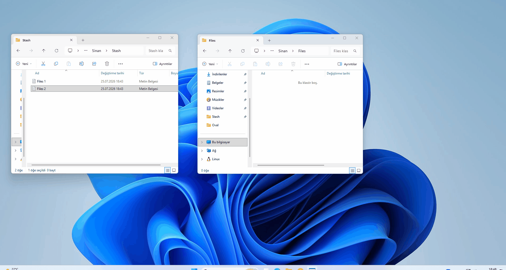
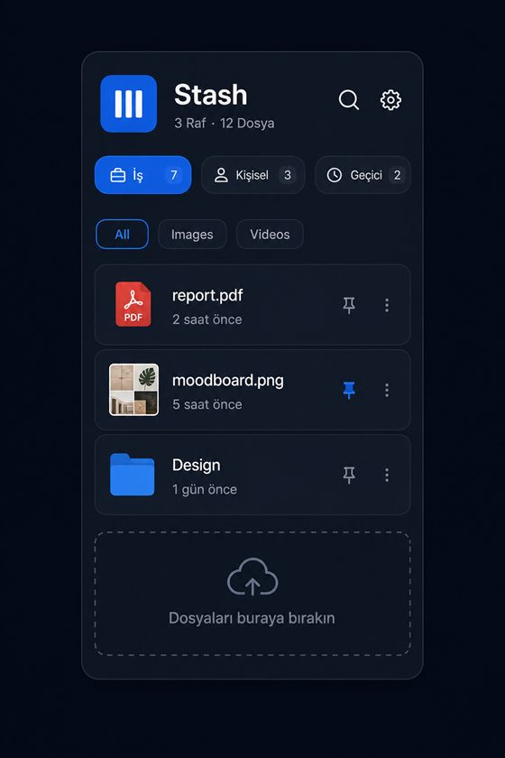
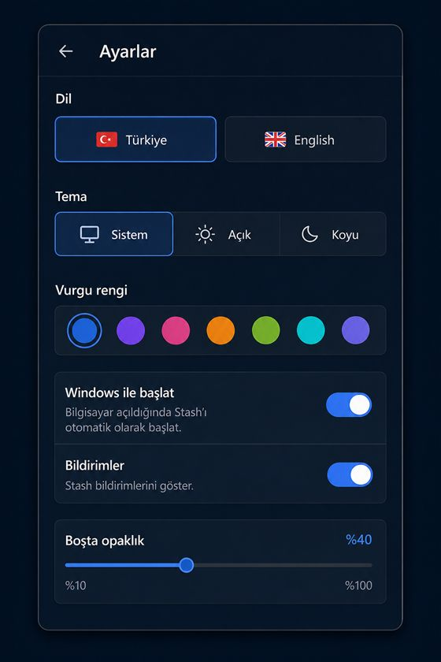
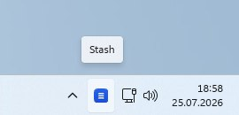

<p align="center">
  
</p>

<h1 align="center">Stash</h1>

<p align="center">
  <strong>A modern file shelf for Windows</strong><br>
  Keep files within reach — without cluttering your desktop.
</p>

<p align="center">
  <a href="https://github.com/Regncreative/Stash/actions/workflows/ci.yml"></a>
  <a href="https://github.com/Regncreative/Stash/actions/workflows/codeql.yml"></a>
  <a href="https://github.com/Regncreative/Stash/releases/latest"></a>
  
  
  
  <a href="LICENSE"></a>
</p>

<p align="center">
  
</p>

## What is Stash?

Windows doesn’t have a convenient place to park files while you work — so people pile them on the desktop, spam Downloads, or lose track mid-flow.

**Stash** adds a lightweight file shelf that lives in the system tray. Drop files onto shelves, pin what matters, then drag them back into any app when you need them. Stash stores **references only** — your files stay where they are on disk.

Designed to feel like a built-in Windows 11 feature (Fluent Design), not a typical Electron utility.

## Features

- **System tray integration** — silent background app, always one click away
- **Drag & drop shelves** — drop files in, drag them out to Explorer, browsers, and other apps
- **Global shortcut** — open the panel with `Ctrl+Shift+Space` (customizable)
- **Multiple shelves** — organize by context (Work, Personal, Temporary…)
- **Instant search & filters** — find files by name, type, or shelf
- **Fluent Design UI** — dark/light themes, accent colors, smooth motion
- **Turkish & English** — full UI + tray localization
- **Auto launch** — start with Windows (installed builds)
- **Auto update** — updates from GitHub Releases
- **SQLite storage** — fast local metadata, no cloud required
- **Missing-file awareness** — deleted or recycled paths show as unavailable until you clear them

## Screenshots

| Panel | Settings | Tray |
|:---:|:---:|:---:|
|  |  |  |

## Installation

### For everyone (recommended)

1. Download **[Stash-Setup.exe](https://github.com/Regncreative/Stash/releases/latest)** from the latest release
2. Run the installer
3. Launch **Stash** — it appears in the system tray
4. Click the tray icon (or press `Ctrl+Shift+Space`) to open the panel

> Tip: enable **Start with Windows** in Settings so Stash is ready after sign-in.

### For developers

```bash
npm install
npm run dev
```

The app starts silently in the tray. Click the tray icon or use the hotkey to open the panel.

## Development

| Command | Description |
|---------|-------------|
| `npm run dev` | Development mode |
| `npm run build` | Production build (`out/`) |
| `npm run dist` | Build Windows installer |
| `npm run typecheck` | TypeScript check |
| `npm run lint` | ESLint |

## Tech stack

- **Electron** + **React** + **TypeScript** + **Vite** (`electron-vite`)
- **Tailwind CSS** + **Framer Motion** + **Zustand**
- **better-sqlite3** for local storage
- **electron-builder** + **electron-updater** for packaging and updates

## Architecture

```text
┌─────────────────────────────────────────┐
│                 Windows                 │
│  Tray · Global hotkey · Shell / files   │
└───────────────────┬─────────────────────┘
                    │
┌───────────────────▼─────────────────────┐
│            Electron Main                │
│  Window · Tray · Auto-launch · Updater  │
└───────────────────┬─────────────────────┘
                    │ IPC
┌───────────────────▼─────────────────────┐
│           Preload bridge                │
│         window.stash (typed API)        │
└───────────────────┬─────────────────────┘
                    │
┌───────────────────▼─────────────────────┐
│           React Renderer                │
│     Fluent panel · shelves · settings   │
└───────────────────┬─────────────────────┘
                    │
┌───────────────────▼─────────────────────┐
│               SQLite                    │
│     shelves · file refs · settings      │
└─────────────────────────────────────────┘
```

## Project structure

```text
src/
  main/           Electron main — tray, panel window, IPC, auto-launch
    database/     SQLite schema + queries
  preload/        contextBridge API (`window.stash`)
  renderer/       React UI (Fluent panel)
  shared/         Shared types, i18n, IPC channel names
resources/        Tray / app icons
docs/             README images
```

## Roadmap

- [x] System tray panel
- [x] Shelves & drag-and-drop
- [x] Global shortcut
- [x] Themes, accents, localization (TR/EN)
- [x] Auto update via GitHub Releases
- [x] Idle opacity & missing-file cleanup
- [x] Official demo GIF in README
- [ ] Plugins / extensions
- [ ] Optional cloud sync
- [ ] Smarter / AI-assisted search

## Releases & auto-update

Packaged builds check [GitHub Releases](https://github.com/Regncreative/Stash/releases) for updates on launch and via tray / settings.

### Publish a new version

1. Bump `version` in `package.json` (e.g. `1.0.1` → `1.0.2`)
2. Create a [GitHub Personal Access Token](https://github.com/settings/tokens) with `repo` scope
3. In PowerShell:

```powershell
$env:GH_TOKEN = "ghp_..."
$env:CSC_IDENTITY_AUTO_DISCOVERY = "false"
# Prefer Temp output if Defender locks C:\Stash\release
npm run release
```

This builds the installer and uploads it to a GitHub Release. Installed copies of Stash download it automatically.

## Contributing

Issues and pull requests are welcome.

1. Fork the repo and create a feature branch
2. Run `npm run lint` and `npm run typecheck` before opening a PR
3. Keep UI changes consistent with the Fluent panel language already in the app

## License

[MIT](LICENSE) © Regncreative
